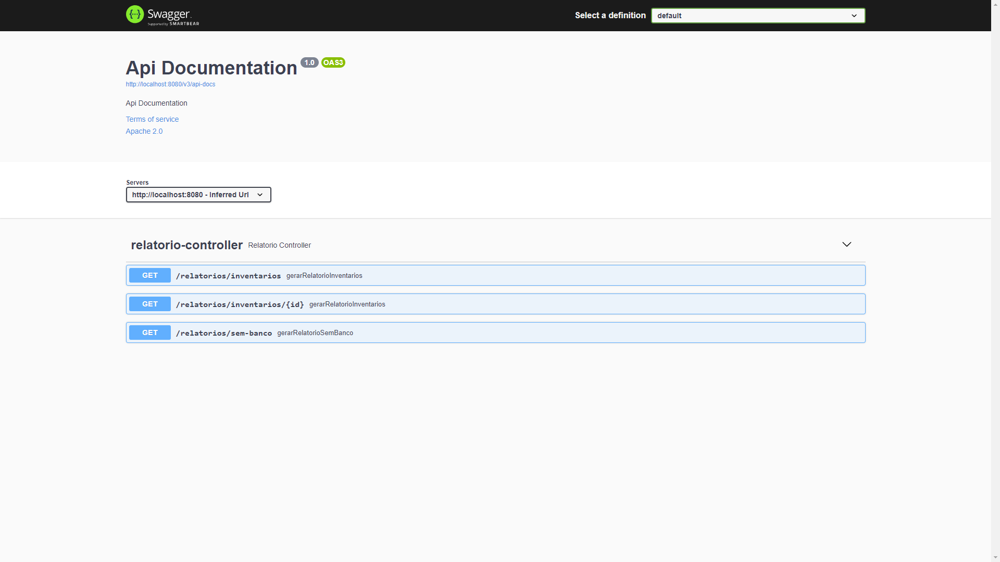
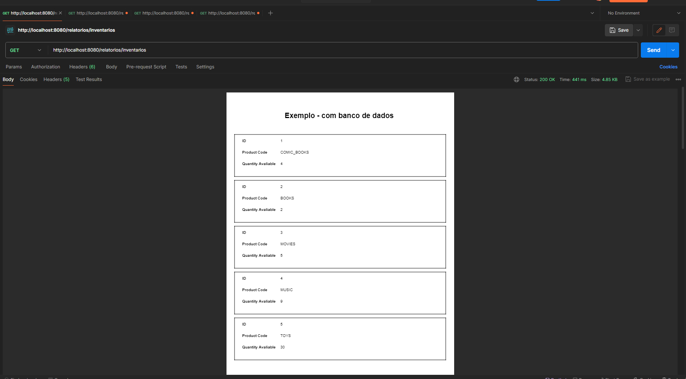
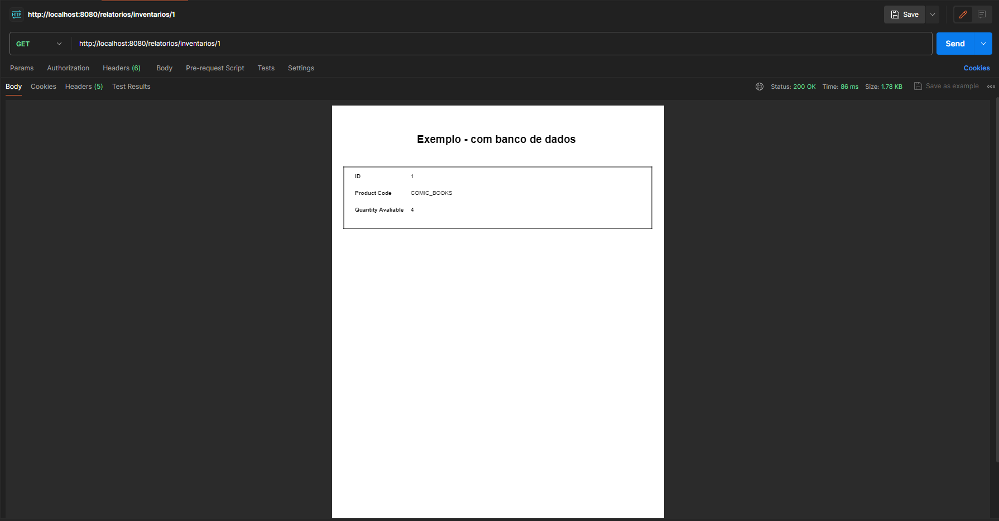
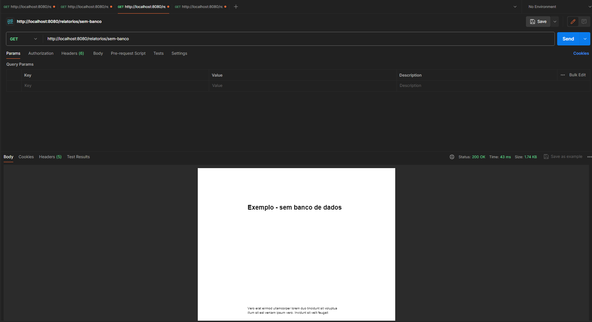
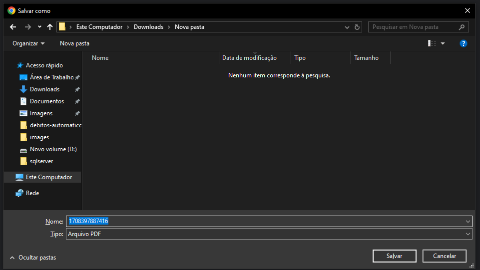

## Tecnologias

* **Java 11**
* **Spring Boot 2.7.13**
* **Postgres**
* **Jasper**

# Executando o projeto
1. Acesse a pasta do relatórios e compile o arquivo JAR:

``` sh
cd relatorios
mvn clean package
```

2. Execute o arquivo docker-compose.yml:

``` sh
docker-compose up -d 
```


### Documentação Swagger
Acesse a documentação da API através do Swagger em: http://localhost:8080/swagger-ui/index.html




### Consultas com Banco de Dados

Consulta de inventários: http://localhost:8080/relatorios/inventarios



Detalhes de um inventário específico: http://localhost:8080/relatorios/inventarios/1



### Consultas sem Banco de Dados

Consulta sem banco de dados: http://localhost:8080/relatorios/sem-banco



### Download
Faça o download do arquivo consultado no navegador adicionando o parâmetro download=true ao final da URL, por exemplo: http://localhost:8080/relatorios/inventarios?download=true

